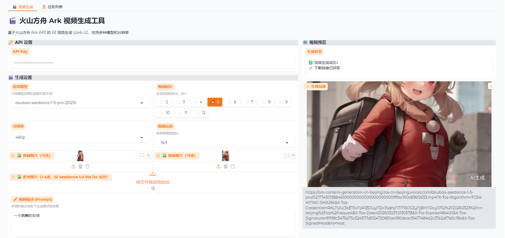

# 🎬 火山方舟 Ark 视频生成工具

基于火山方舟 Ark API 的 AI 视频生成 Web UI，支持文生视频、图生视频（首帧/首尾帧/参考图）等多种生成模式。



---

## 🚀 快速开始

### 环境要求

- Python 3.8+
- 已安装依赖：`pip install -r requirements.txt`

### 启动方式

```bash
python app.py
```

启动后访问：**http://127.0.0.1:7860**

### API Key 配置

方式一：在 Web UI 输入框直接输入  
方式二：设置环境变量 `ARK_API_KEY`

---

## 🎯 功能一览

### 视频生成模式

| 模式 | 说明 | 支持模型 |
|------|------|---------|
| **文生视频** | 仅输入文本提示词生成视频 | 全部模型 |
| **首帧图生视频** | 上传首帧图片 + 文本生成视频 | Seedance 1.5 pro、1.0 pro、1.0 lite |
| **首尾帧图生视频** | 上传首帧 + 尾帧图片生成视频 | Seedance 1.5 pro、1.0 pro、1.0 lite |
| **参考图生视频** | 上传 1-4 张参考图生成视频 | Seedance 1.0 lite i2v |

---

## 📋 参数说明

### 模型选择

| 模型 ID | 说明 | 支持功能 |
|---------|------|---------|
| `doubao-seedance-1-5-pro-251215` | Seedance 1.5 pro（最新） | 文生视频、图生视频、音频生成 |
| `doubao-seedance-1-0-pro-250118` | Seedance 1.0 pro | 文生视频、图生视频 |
| `doubao-seedance-1-0-pro-fast-250118` | Seedance 1.0 pro fast | 文生视频、图生视频（快速） |
| `doubao-seedance-1-0-lite-t2v-250118` | Seedance 1.0 lite 文生 | 仅文生视频 |
| `doubao-seedance-1-0-lite-i2v-250118` | Seedance 1.0 lite 图生 | 参考图生视频 |

### 分辨率

- `480p` - 标清，适合快速预览
- `720p` - 高清，默认选项
- `1080p` - 全高清

### 画面比例

| 比例 | 像素（720p 示例） | 适用场景 |
|------|-----------------|---------|
| `16:9` | 1280×720 | 横屏视频、默认 |
| `4:3` | 1112×834 | 传统比例 |
| `1:1` | 960×960 | 方形视频 |
| `3:4` | 834×1112 | 竖屏图文 |
| `9:16` | 720×1280 | 手机竖屏 |
| `21:9` | 1470×630 | 电影宽屏 |
| `adaptive` | 自动适配 | 根据输入自动选择 |

### 视频时长

支持 **2-12 秒**，可自定义。

### 其他参数

- **水印**：默认关闭，开启后视频带水印
- **音频**：Seedance 1.5 pro 支持生成同步音频
- **镜头固定**：默认关闭，开启后镜头固定不运动
- **返回尾帧**：开启后可获取生成视频的尾帧图像

---

## 🖼️ 图片上传说明

### 支持的图片格式

- 格式：JPEG、PNG、WEBP、BMP、TIFF、GIF
- 宽高比：0.4 ~ 2.5
- 大小：< 30MB

### 上传方式

1. **首帧图片** - 单张图片，作为视频的起始画面
2. **尾帧图片** - 单张图片，作为视频的结束画面（需同时上传首帧）
3. **参考图片** - 1-4 张图片，参考图生视频模式

> 💡 **提示**：首帧+尾帧同时上传 = 首尾帧模式；只有首帧 = 首帧模式；参考图 = 参考图模式

---

## 📋 任务列表

点击顶部「📋 任务列表」Tab 可查看：

- 所有生成任务记录
- 按状态筛选（全部/排队中/运行中/成功/失败/已过期）
- 直接下载已成功的视频

---

## 🔧 常见问题

### Q: 视频生成失败怎么办？

1. 检查 API Key 是否有效
2. 确认账户余额充足
3. 检查图片格式和大小是否符合要求
4. 查看「任务列表」中的具体错误信息

### Q: 生成速度慢？

- Seedance 1.0 pro fast 模式更快
- 降低分辨率（1080p → 720p）
- 使用离线推理模式（flex）可获得更高配额

### Q: 如何查看更多模型信息？

访问 [火山方舟 Ark 控制台](https://console.volcengine.com/ark/region:ark+cn-beijing/experience/vision)

---

## 📡 API 参考

本工具基于火山方舟视频生成 API 构建：

- **创建任务**：`POST https://ark.cn-beijing.volces.com/api/v3/contents/generations/tasks`
- **查询任务**：`GET https://ark.cn-beijing.volces.com/api/v3/contents/generations/tasks/{id}`
- **批量查询**：`GET https://ark.cn-beijing.volces.com/api/v3/contents/generations/tasks`

详细 API 文档：[火山方舟视频生成 API](https://www.volcengine.com/docs/82379/1520757)

---

## 📝 目录结构

```
Ask-Video-generation-Web-UI-video-webui/
├── app.py          # Gradio Web UI 主文件
├── api.py          # Ark API 封装
├── config.py       # 配置文件
├── requirements.txt # Python 依赖
└── aiapi.md        # 原始 API 文档
```

---


---

## ☕ 如果对你有帮助，能请我喝杯咖啡吗？谢谢！

| 微信支付 | 支付宝 |
|:--------:|:------:|
|  |  |

---

*工具免费使用，一杯咖啡是对我最好的支持～*

